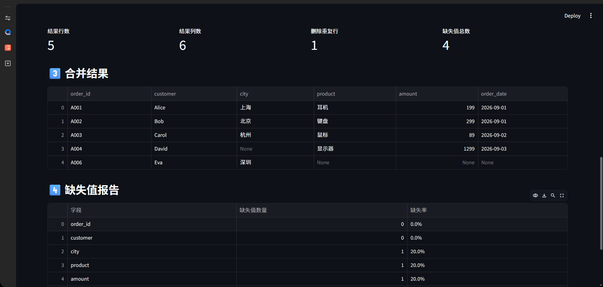

# Excel Automation Tool 📊

一个基于 **Python + Pandas + Streamlit** 开发的轻量级 Excel / CSV 数据自动化工具。

它面向真实的数据整理场景，把原本需要手动完成的 **多表合并、清洗、去重、缺失值检查和结果导出** 集中到一个简单的网页界面中。



---

## ✨ 主要功能

| 功能 | 说明 |
|---|---|
| 文件上传 | 支持 `.xlsx` 和 `.csv` |
| 数据预览 | 上传后直接查看两份数据 |
| 自动识别共同字段 | 自动寻找两张表可用于关联的同名字段 |
| 多种合并方式 | 支持 Left / Inner / Outer Join |
| 数据清洗 | 自动清理列名与文本首尾空格 |
| 重复值处理 | 自动删除完全重复的数据行 |
| 缺失值检查 | 统计各字段缺失数量与缺失率 |
| 结果预览 | 网页中直接查看最终处理结果 |
| Excel 导出 | 一键下载 `processed_result.xlsx` |

---

## 🎯 适用场景

这个工具适合处理常见的重复性表格任务，例如：

- 多份订单表合并
- 客户数据整合
- Excel / CSV 数据清洗
- 重复记录检查
- 缺失值分析
- 日常运营报表整理
- 销售数据预处理
- 简单的数据交付任务

---

## 🛠️ 技术栈

- **Python**
- **Pandas**
- **Streamlit**
- **OpenPyXL**

---

## 📁 项目结构

```text
excel-automation-tool/
│
├── app.py
├── requirements.txt
├── README.md
├── run.bat
├── sample_orders.xlsx
├── sample_customers.xlsx
└── images/
    └── demo.png
```

---

## 🚀 快速开始

### 1. 克隆项目

```bash
git clone <your-repository-url>
cd excel-automation-tool
```

### 2. 安装依赖

Windows：

```bash
py -m pip install -r requirements.txt
```

如果你的环境可以直接使用 `python`：

```bash
python -m pip install -r requirements.txt
```

### 3. 启动项目

Windows：

```bash
py -m streamlit run app.py
```

或：

```bash
python -m streamlit run app.py
```

运行成功后，浏览器会自动打开：

```text
http://localhost:8501
```

---

## ⚡ Windows 一键启动

Windows 用户也可以直接双击：

```text
run.bat
```

启动脚本会安装所需依赖并运行 Streamlit。

---

## 🧪 使用示例

项目中提供了两份测试文件：

```text
sample_orders.xlsx
sample_customers.xlsx
```

两张表都包含：

```text
order_id
```

测试步骤：

1. 上传 `sample_orders.xlsx`
2. 上传 `sample_customers.xlsx`
3. 选择 `order_id` 作为关联字段
4. 选择合并方式
5. 点击 **开始处理**
6. 查看处理结果与缺失值报告
7. 下载处理后的 Excel 文件

---

## 🔄 工作流程

```text
上传 Excel / CSV
        ↓
自动识别共同字段
        ↓
选择关联字段和合并方式
        ↓
数据清洗 + 去重
        ↓
表格合并
        ↓
缺失值检查
        ↓
结果预览
        ↓
导出 Excel
```

---

## 💡 为什么做这个项目

很多真实工作场景中的数据处理并不复杂，但会大量占用时间，例如：

```text
打开 Excel
→ 复制
→ 粘贴
→ 对齐字段
→ 去重
→ 检查空值
→ 保存新文件
```

这个项目尝试把这类重复流程自动化，减少人工操作，并将 Python 数据处理能力包装成非技术用户也能直接使用的网页工具。

---

## 🔮 后续计划

未来可以继续扩展：

- [ ] 多文件批量上传
- [ ] 自定义字段映射
- [ ] 批量 Excel 合并
- [ ] 日期格式自动处理
- [ ] 金额字段识别
- [ ] 条件筛选
- [ ] 数据统计图表
- [ ] Streamlit Dashboard
- [ ] 自动生成处理报告
- [ ] Excel 输出格式美化
- [ ] 历史任务记录

---

## 💼 Freelance Service

I can help automate repetitive Excel / CSV workflows with Python.

Possible tasks include:

- Excel data cleaning
- CSV processing
- Multiple file merging
- Duplicate removal
- Missing-data analysis
- Automated report generation
- Simple Streamlit dashboards
- Repetitive spreadsheet workflow automation

This project is a small demonstration of the kind of automation workflow I can build.

---

## 📄 License

For learning, portfolio demonstration and personal project use.
